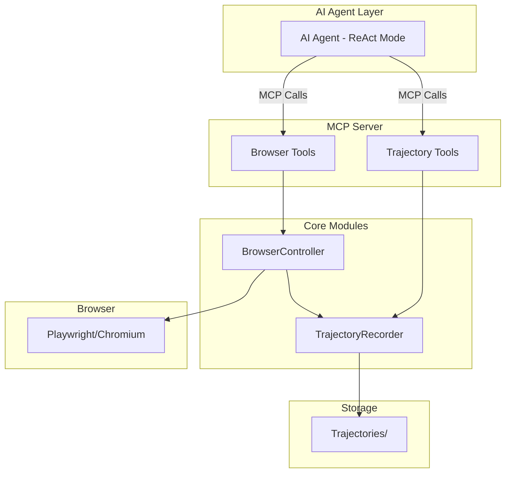

# ZeroToken

[](https://github.com/AMOS144/zerotoken/actions/workflows/ci.yml)

**ZeroToken - Record once, automate forever.**

> Lightweight MCP for AI agent browser automation. Record once, replay forever — cut token cost and speed up repetitive tasks.

一个面向 AI Agent 的轻量化浏览器自动化 MCP 引擎，支持操作记录与详细执行上下文导出。

## OpenClaw 集成（推荐）

ZeroToken 推荐与 OpenClaw 搭配，用作浏览器执行层与轨迹重放引擎。

- **MCP 已通过 Marketplace 安装时**：在支持 MCP 的客户端（如 Cursor / OpenClaw）中启用名为 `zerotoken` 的 MCP server，然后在 OpenClaw 安装 `zerotoken-openclaw` Skill（见 `docs/skills.md`），即可在工作流中直接使用 ZeroToken 的浏览器工具和轨迹脚本。
- **本地开发 / 调试场景**：按照下文「安装」「快速开始」章节启动本地 `mcp_server.py`，并在客户端中将其注册为 id 为 `zerotoken` 的 MCP server，再搭配 `zerotoken-openclaw` Skill 使用。

典型工作流示例和脚本格式说明见：

- `docs/skills.md`：OpenClaw Skill 安装与约定
- `skills/zerotoken-openclaw/SKILL.md`：教会 Agent 何时录制轨迹、何时生成脚本、如何以低 Token 成本重放
- `docs/examples/*.md`：基础示例与稳定性测试示例

## 核心理念

### 问题
AI Agent 直接控制浏览器执行重复任务时，每次都需要消耗大量 Token 进行推理，成本高且执行速度慢。

### ZeroToken 解决方案

1. **操作执行**: AI 通过 ReAct 模式分步推理，调用 MCP 原子能力完成浏览器操作
2. **轨迹记录**: 系统记录完整的操作轨迹（包括页面状态、截图、执行结果、模糊点标记）
3. **AI 提示导出**: 轨迹可导出为 AI 友好格式，含需判断的模糊点说明，供 Skills 或其他模块进一步分析

## 核心特性

- **完整轨迹记录** - 每次操作记录步骤、页面状态、截图
- **结构化操作记录** - OperationRecord 包含完整的执行上下文
- **模糊点标记** - 显式标记需 AI/人判断的步骤（如验证码、多选链接），含 reason 与 hint
- **MCP 协议** - 标准化接口，易于集成到各种 AI Agent
- **稳定性增强** - 智能选择器、等待策略、错误恢复三大模块
- **自适应元素定位** - 首次命中时保存元素指纹（auto_save），改版后选择器失效时按相似度重定位（adaptive），无需改代码
- **反爬/云盾应对** - `browser_init(stealth=true)` 启用隐蔽启动与指纹伪装，降低被识别为自动化浏览器的概率（先能抓得到，Cloudflare 过验证后续可选）

## 稳定性增强

### 不稳定因素分析

```
选择器失效 (60%)     动态 ID、类名变化、DOM 结构改变
时序问题 (25%)       元素未加载、网络请求、动画未执行
环境变化 (10%)       视口变化、用户状态、Cookie 影响
其他因素 (5%)        弹窗干扰、资源加载失败
```

### 解决方案

**1. SmartSelector - 智能选择器生成**
- 自动生成多个备选选择器
- 优先级：data-testid > id > aria > CSS > XPath
- 检测并过滤不稳定类名（如 `el-*`, `ant-*`, `Mui-*`）

**2. SmartWait - 智能等待策略**
- 多种等待条件：selector, visible, networkidle, text, function
- 级联等待支持
- 页面稳定性检测

**3. ErrorRecovery - 错误恢复机制**
- 自动检测错误类型
- 选择器变体尝试
- 指数退避重试
- iframe 内元素查找

## 系统架构

```
┌─────────────────────────────────────────────────────────────┐
│                     AI Agent (ReAct 模式)                    │
│  系统提示词：分步推理 → 调用 MCP → 分析结果 → 下一步          │
└─────────────────────────────────────────────────────────────┘
                              │
                              │ MCP 工具调用
                              ▼
┌─────────────────────────────────────────────────────────────┐
│                  ZeroToken MCP Server                        │
│  ┌──────────────────────────────────────────────────────┐   │
│  │  Browser Tools (原子能力层)                            │   │
│  │  - browser_open(url) → OperationRecord               │   │
│  │  - browser_click(selector) → OperationRecord         │   │
│  │  - browser_input(selector, text) → OperationRecord   │   │
│  │  - browser_get_text(selector) → OperationRecord      │   │
│  │  - browser_extract_data(schema) → OperationRecord    │   │
│  │  ...                                                  │   │
│  └──────────────────────────────────────────────────────┘   │
│  ┌──────────────────────────────────────────────────────┐   │
│  │  Trajectory Tools (轨迹管理)                           │   │
│  │  - trajectory_start(task_id, goal)                   │   │
│  │  - trajectory_complete() → AI Prompt (含模糊点)       │   │
│  │  - trajectory_get(format=json|ai_prompt) 当前轨迹      │   │
│  │  - trajectory_list(limit?, since?) 已保存列表         │   │
│  │  - trajectory_load(task_id, format?) 按 task_id 加载  │   │
│  │  - trajectory_delete(task_id) 删除已保存轨迹          │   │
│  └──────────────────────────────────────────────────────┘   │
└─────────────────────────────────────────────────────────────┘
                              │
                              ▼
┌─────────────────────────────────────────────────────────────┐
│                 OperationRecord (结构化记录)                  │
│  {                                                            │
│    "step": 1,                                                │
│    "action": "click",                                        │
│    "params": {"selector": "#login-btn"},                     │
│    "result": {"success": true, "navigated": true},           │
│    "page_state": {"url": "...", "title": "..."},             │
│    "screenshot": "base64...",  ← 视觉快照                     │
│    "fuzzy_point": {         ← 可选，需判断时存在               │
│      "requires_judgment": true,                              │
│      "reason": "验证码需识别", "hint": "AI 视觉"               │
│    },                                                         │
│    "timestamp": "2024-01-01T12:00:00"                        │
│  }                                                            │
└─────────────────────────────────────────────────────────────┘
```

### Mermaid 架构图



## 安装

```bash
# 克隆项目
git clone https://github.com/AMOS144/zerotoken.git
cd zerotoken

# 安装依赖
uv sync

# 安装 Playwright 浏览器
playwright install chromium
```

## 快速开始

### 1. 启动 MCP Server

```bash
python mcp_server.py
```

### 2. AI Agent 通过 MCP 调用浏览器工具

示例流程：

```
# 初始化浏览器（遇反爬/云盾可传 stealth=true）
→ browser_init(headless=true)
← {"success": true, "config": {...}}

# 开始轨迹记录
→ trajectory_start(task_id="login_task", goal="登录系统")
← {"success": true, "task_id": "login_task"}

# 执行浏览器操作（自动记录到轨迹）
→ browser_open(url="https://example.com/login")
← {
     "step": 1,
     "action": "open",
     "params": {"url": "https://example.com/login"},
     "result": {"success": true, "title": "Login"},
     "page_state": {"url": "...", "title": "..."},
     "screenshot": "base64..."
   }

→ browser_input(selector="#username", text="testuser")
→ browser_input(selector="#password", text="secret123")
→ browser_click(selector="#submit-btn")

# 完成轨迹并获取 AI 提示（含模糊点标记）
→ trajectory_complete(export_for_ai=true)
← {
     "success": true,
     "ai_prompt": "Task Goal: 登录系统\n\nOperation History:\n[Step 1] open(...)\n[Step 2] click(...) [需判断: 验证码需识别]"
   }
```

AI 收到 `ai_prompt` 后，可结合 Skills 或自定义逻辑，对标记为「需判断」的步骤进行处理。建议通过 `trajectory_list` 查看已保存轨迹，对不需要的调用 `trajectory_delete(task_id)` 避免记录过多；browser 类工具可传 `include_screenshot: false` 减少响应体积；失败时返回结构化错误（含 `code`、`retryable`）便于模型重试。对关键元素可传 `auto_save: true` 保存指纹，改版后传 `adaptive: true` 自动重定位。

## 核心模块 API

### BrowserController

```python
from zerotoken import BrowserController

controller = BrowserController()
await controller.start(headless=True)

# 每个操作都返回 OperationRecord
record = await controller.open("https://example.com")
print(record.to_dict())
# {
#   "step": 1,
#   "action": "open",
#   "params": {...},
#   "result": {...},
#   "page_state": {...},
#   "screenshot": "base64..."
# }

await controller.stop()
```

### TrajectoryRecorder

```python
from zerotoken import TrajectoryRecorder, BrowserController

controller = BrowserController()
recorder = TrajectoryRecorder()
recorder.bind_controller(controller)

# 开始记录
recorder.start_trajectory("task_001", "完成用户登录")

# 执行操作（自动记录）
await controller.open("https://example.com")
await controller.click("#login-btn")

# 完成记录
trajectory = recorder.complete_trajectory()
recorder.save_trajectory()

# 导出给 AI 分析（含模糊点标记）
ai_prompt = trajectory.to_ai_prompt_format()
```

### 模糊点标记 (fuzzy_point)

需要 AI 或人工判断的步骤可标记为模糊点：

```python
# extract_data 默认自动标记 fuzzy_point
record = await controller.extract_data(schema)

# 其他操作可手动传入 fuzzy_reason、fuzzy_hint
record = await controller.click("#link", fuzzy_reason="页面有多个链接", fuzzy_hint="需选择目标链接")
```

## OperationRecord 结构

每个浏览器操作都返回详细的 OperationRecord：

```json
{
  "step": 1,
  "action": "click",
  "params": {
    "selector": "#submit-btn",
    "timeout": 30000
  },
  "result": {
    "success": true,
    "navigated": true,
    "new_url": "https://example.com/dashboard"
  },
  "page_state": {
    "url": "https://example.com/dashboard",
    "title": "Dashboard",
    "timestamp": "2024-01-01T12:00:00"
  },
  "screenshot": "base64_encoded_image_data",
  "fuzzy_point": {
    "requires_judgment": true,
    "reason": "验证码需识别",
    "hint": "AI 视觉"
  },
  "timestamp": "2024-01-01T12:00:00"
}
```

`fuzzy_point` 为可选字段，仅在需要 AI/人判断的步骤存在。导出 AI 提示时，会追加 `[需判断: {reason}]` 等标记。

## 项目结构

```
zerotoken/
├── zerotoken/
│   ├── __init__.py
│   ├── controller.py         # BrowserController - 浏览器控制
│   ├── trajectory.py         # TrajectoryRecorder - 轨迹记录
│   ├── selector.py           # SmartSelector - 智能选择器
│   ├── wait_strategy.py      # SmartWait - 等待策略
│   └── recovery.py           # ErrorRecovery - 错误恢复
├── trajectories/             # 轨迹文件存储
├── mcp_server.py             # MCP Server 入口
├── examples.py               # 使用示例
└── README.md
```

## 使用场景

1. **AI Agent 浏览器自动化** - OpenClaw、LLM Agent 等
2. **RPA 流程自动化** - 重复性网页操作录制回放
3. **数据采集** - 定时抓取网页数据
4. **自动化测试** - 记录测试步骤并回放

更多示例见根目录 `examples.py`、`examples_stability.py`。

**OpenClaw 配套 Skill**：见 [docs/skills.md](docs/skills.md)，用于定时/重复任务时按轨迹重放、降低 Token 消耗。

## 参与贡献

欢迎提 Issue 和 PR，详见 [CONTRIBUTING.md](CONTRIBUTING.md)。

## License

MIT License，见 [LICENSE](LICENSE)。

---

**ZeroToken** - Record once, automate forever.
